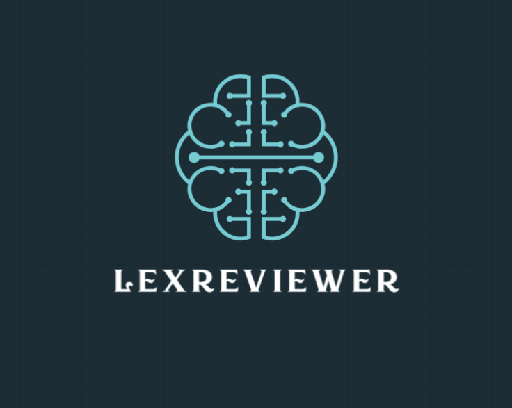

<div align="center">
  <div style="margin: 20px 0;">
    
  </div>

  # 🚀 LexReviewer – Legal Document Chat & RAG Service
</div>

**Citation-aware legal document chat**

Legal PDFs are a pain to search, and you can’t really “talk” to them, plus when you do get answers elsewhere, they often lack traceable citations, so you can’t point to the exact spot in the source or highlight it. LexReviewer tackles that by turning your legal PDFs into an interactive, **citation-aware chat experience**. Upload documents, index them into a RAG pipeline, and ask questions; answers stay grounded in the source text with **reference positions and bounding boxes** you can use for highlighting.

As a single backend service, **LexReviewer** brings together PDF ingestion, vector + keyword retrieval, streaming RAG chat, chat history, and document-linked retrieval, so you don’t need to wire up a bunch of tools yourself. It’s built with legal document understanding in mind and fits well for contract review, compliance, research, and any workflow where you need to query and cite from large PDF collections.

**What’s included:**

- 🤖 **LangGraph-powered agent** — Picks the right tools per question (in-doc search, linked docs, or both) so you get focused answers instead of a one-size-fits-all pipeline; handles multi-step queries and follow-ups in context.
- 📄 **PDF ingestion & chunking** — Unstructured.io turns your PDFs into searchable chunks so the agent can pull the right passages.
- 🔍 **Vector + BM25 retrieval** — Qdrant plus keyword search so both semantic and exact-phrase questions hit the right content.
- 💬 **Streaming RAG chat** — Answers stream as NDJSON with thoughts and references, so you see citations and can highlight in the source as they arrive.
- 📚 **Chat history** — Persisted in MongoDB so the agent keeps conversation context and follow-up questions stay grounded.
- 🔗 **Linked document awareness** — When your doc references amendments, schedules, or MSAs, the agent can fetch and query those too for full contract context.
- 📊 **Observability** — Langfuse and optional Sentry so you can trace and debug runs without guessing.

---

## Tech Stack

<table>
<thead>
<tr>
<th>Area</th>
<th>Technology</th>
</tr>
</thead>
<tbody>
<tr><td><strong>Language</strong></td><td>Python</td></tr>
<tr><td><strong>API</strong></td><td>FastAPI, Uvicorn</td></tr>
<tr><td><strong>Web UI</strong></td><td>Streamlit (<code>ui/</code>)</td></tr>
<tr><td><strong>RAG / Agent</strong></td><td>LangChain, LangChain Community, LangChain Core, LangGraph, Rank-BM25</td></tr>
<tr><td><strong>LLM &amp; Embeddings</strong></td><td>OpenAI (chat models e.g. gpt-4, gpt-4.1-mini, gpt-5.2; embedding <code>text-embedding-3-large</code>)</td></tr>
<tr><td><strong>Storage</strong></td><td>MongoDB (chat history, doc store), Qdrant (vector embeddings, filter by <code>document_id</code>)</td></tr>
<tr><td><strong>Document processing</strong></td><td>Unstructured.io – PDF parsing, chunking, positions/bounding boxes</td></tr>
<tr><td><strong>Observability</strong></td><td>Langfuse, Sentry</td></tr>
</tbody>
</table>

---

## Setup Instructions

### Prerequisites

- **Python**: A modern Python 3 interpreter compatible with the packages in `requirements.txt` (e.g., Python 3.10+).
- **MongoDB**:
  - Running instance reachable by `MONGODB_URL`.
- **Qdrant**:
  - Running Qdrant instance reachable by `QDRANT_URL`.
- **Unstructured.io**:
  - Valid **Unstructured API key** (`UNSTRUCTURED_API_KEY`) and network access.
- **OpenAI**:
  - Valid **OpenAI API key** (`OPENAI_API_KEY`) and network access.

### Installation

From the project root:

```bash
# Create and activate a virtual environment (recommended)
python -m venv .venv
# On Windows PowerShell
.venv\Scripts\Activate.ps1
# On Unix-like shells
source .venv/bin/activate

# Install dependencies
pip install -r requirements.txt
```

### Environment Variables

Use `.env` at the project root. **Key variables** (minimum to run):

| Variable | Purpose |
|----------|---------|
| `OPENAI_API_KEY` | Required for LLM and embeddings |
| `UNSTRUCTURED_API_KEY` | Required for PDF chunking |
| `MONGODB_URL` | MongoDB connection (default `mongodb://localhost:27017`) |
| `QDRANT_URL` | Qdrant endpoint |
| `LINKED_DOCUMENT_FETCH_URL` | Base URL for linked documents retriever |

Create your `.env`: `cp .env.example .env` then edit. See `.env.example` for the full list.

<details>
<summary><strong>Full environment variable list</strong></summary>

- **Application & prompts:** `CHATBOT_NAME`, `AGENT_MODEL`, `REASNONING_AGENT_MODEL` (note typo), `AGENT_REASONING_ALLOWED`
- **Linked documents:** `LINKED_DOCUMENT_FETCH_URL`
- **Unstructured.io:** `UNSTRUCTURED_API_KEY`, plus `UNSTRUCTURED_*` options (max chars, overlap, strategy, etc.)
- **OpenAI:** `OPENAI_API_KEY`, `OPENAI_CHAT_SUMMARY_MODEL`, `OPENAI_CHUNK_SUMMARY_MODEL`, `REQUIRED_TOOLS_GENERATOR_MODEL`, `OPENAI_EMBEDDING_MODEL_NAME`
- **MongoDB:** `MONGODB_URL`, `MONGODB_DATABASE`, `MONGODB_CHAT_HISTORY_COLLECTION_NAME`, `MONGODB_DOC_STORE_COLLECTION_NAME`
- **Qdrant:** `QDRANT_URL`, `QDRANT_API_KEY`, `QDRANT_TIMEOUT`, `QDRANT_COLLECTION_NAME`, `QDRANT_VECTOR_SIZE`
- **Observability (optional):** `SENTRY_DSN`, `LANGFUSE_SECRET_KEY`, `LANGFUSE_PUBLIC_KEY`, `LANGFUSE_HOST`

</details>

---

## How to Run

From the project root (after installing dependencies and configuring `.env`):

| Command | Purpose |
|--------|--------|
| `python app.py` | Start API (Uvicorn with reload) at `http://0.0.0.0:8000` |
| `streamlit run ui/ui_app.py` | Start Streamlit chat UI (backend must be running) |
| `uvicorn app:app --host 0.0.0.0 --port 8000` | Run API without reload (e.g. production) |

The Streamlit UI lets you set a document ID in the sidebar, upload/index a PDF, and chat with the indexed document.

---

## Usage Guide

### Overview of User Workflow

You can interact with the system in two ways:

- **Via HTTP API** directly (e.g., `curl`, Postman, or another backend).
- **Via the built-in Streamlit UI** in `ui/`.

1. **Upload a document (PDF)**  
   Use `/upload-documents` to send a base64-encoded PDF along with a `document-id`.  
   The backend will:
   - Chunk the document via Unstructured.io.
   - Optionally summarize chunks.
   - Create embeddings and index them into Qdrant.
   - Store full content and metadata (including bounding boxes) in MongoDB.

2. **Ask questions about the document**  
   Use `/ask` with the same `document-id`, plus user identifiers, to start a chat.  
   The endpoint streams results (NDJSON) containing:
   - Answer text chunks
   - Thought snippets (agent reasoning commentary)
   - Reference positions that can be mapped back to document regions.

3. **Manage chat history**  
   Use the history-related endpoints to:
   - List history (`/get-history`)
   - Revert to a certain history entry (`/revert-history`)
   - Clear history (`/clear-history`)
   - Save or modify messages (`/save-message-in-history`)

4. **Manage document index**  
   Use `/collection-exists` to check if a document (or several) has already been indexed.  
   Use `/delete-vector` to remove the indexed vectors and history for a document.

### Using the built-in Streamlit UI

The Streamlit UI (`ui/ui_app.py`) wires upload, chat, and history into an interactive web app.

<details>
<summary><strong>Streamlit component map</strong></summary>

- **Document selection & history** (`ui/components/sidebar.py`): Set active `document_id`. **Load History** → `GET /get-history`. **Clear History** → `DELETE /clear-history`. **Reset Document** → `DELETE /delete-vector`.
- **Upload & indexing** (`ui/components/uploader.py`): PDF file picker; **Index Document** base64-encodes and calls `POST /upload-documents`; on success unlocks chat panel.
- **Chat** (`ui/components/chat.py` + `api.py`): Renders Q&A from `st.session_state.chat_messages`; `st.chat_input` sends questions; streams via `POST /ask` (NDJSON): `chunk` → answer text, `thought` → “Agent Thinking” expander; `reference_positions` stored in messages (not yet rendered in UI).

</details>

For request/response examples and curl snippets, see **Detailed API request/response** under [API Endpoints](#api-endpoints).

---

## Architecture Overview

### High-Level Flow

```text
+------------------+       +-------------------+       +----------------+
|   Client / UI    | --->  |   FastAPI (app)   | --->  |   LangGraph    |
+------------------+       +-------------------+       +----------------+
         |                          |                             |
         | /upload-documents        |                             |
         |------------------------->|                             |
         |                          |    PDFChunker + RAGIngest   |
         |                          |----> Chunk + Summarize ---->|
         |                          |                             |
         | /ask                     |                             |
         |------------------------->|    DocumentReviewer (graph) |
         |                          |----> Tools: retriever,      |
         |                          |     linked_documents        |
         |                          |                             |
         |  NDJSON stream (answer,  |<----------------------------|
         |  thoughts, references)   |                             |
```

### Components and Data Flow

- **Ingestion pipeline (`RAGIngestPipeline`, `PDFChunker`, `ChunkSummarizer`, `EmbeddingIndexer`)**:
  1. Take a PDF uploaded via `/upload-documents`.
  2. Use Unstructured.io to chunk the document; metadata contains layout and bounding boxes.
  3. Optionally summarize chunks to create more compact index entries.
  4. Compute embeddings using OpenAI.
  5. Store:
     - Embeddings in Qdrant with `document_id` metadata.
     - Full chunks and metadata in MongoDB docstore.

- **Retrieval layer (`document_retriever`, `linked_documents`)**:
  - **Document retriever**:
    - Combines Qdrant vector search and BM25 keyword search.
    - Uses `document_id` to restrict results.
    - Fetches full chunk content and bounding boxes from MongoDB.
  - **Linked documents tool**:
    - Calls an external HTTP service (URL from `LINKED_DOCUMENT_FETCH_URL`) to fetch related documents that can also be used in responses.

- **Agent layer (`DocumentReviewer`, `agent_graph/nodes`)**:
  - A LangGraph graph manages the conversation state (`AgentState`).
  - **Required tools generator node** selects which tools to call (e.g., document retriever, linked document retriever).
  - **Agent prompt generator node** composes prompts that:
    - Include the user question
    - Inject context from tools
    - Follow the legal-answer prompt template
  - **Agent node** runs the OpenAI-backed LLM, possibly in reasoning mode, and streams out partial answers, thoughts, and references.

- **Chat history (`storage/MongoDB`, `services/chat_service`)**:
  - Uses `MongoDBChatMessageHistory` with session IDs like `"{user_id}_{document_id}"`.
  - Enables:
    - Persisted multi-turn conversations
    - Summarization of older turns to keep context manageable

- **Observability (`observation`)**:
  - Langfuse integration can trace key steps (summarization, retrieval, answering).
  - Sentry can capture exceptions and performance data.

There is **no separate frontend** in this repo; it is purely a backend API intended to be consumed by a client (web app, desktop app, etc.).

---

## API Endpoints

Endpoints are defined in `app.py`. Request/response shapes: `models.py` and OpenAPI schema.

<table>
<thead>
<tr>
<th>Endpoint</th>
<th>Method</th>
<th>Key headers / body</th>
<th>Purpose</th>
</tr>
</thead>
<tbody>
<tr><td><code>/upload-documents</code></td><td>POST</td><td><code>document-id</code>; body: <code>file</code> (base64 PDF)</td><td>Chunk, embed, index document</td></tr>
<tr><td><code>/collection-exists</code></td><td>POST</td><td><code>document-ids</code></td><td>Check if document(s) are indexed</td></tr>
<tr><td><code>/ask</code></td><td>POST</td><td><code>document-id</code>, <code>user-id</code>, <code>username</code>; body: <code>question</code></td><td>Stream NDJSON (chunk, thought, reference_positions)</td></tr>
<tr><td><code>/get-history</code></td><td>GET</td><td><code>document-id</code>, <code>user-id</code></td><td>Return chat history</td></tr>
<tr><td><code>/save-message-in-history</code></td><td>POST</td><td><code>document-id</code>, <code>user-id</code>; body: message data</td><td>Persist or update chat entry</td></tr>
<tr><td><code>/revert-history</code></td><td>POST</td><td><code>document-id</code>, <code>user-id</code>; body: <code>index</code></td><td>Truncate history to index</td></tr>
<tr><td><code>/clear-history</code></td><td>DELETE</td><td><code>document-id</code>, <code>user-id</code></td><td>Clear chat history</td></tr>
<tr><td><code>/delete-vector</code></td><td>DELETE</td><td><code>document-id</code>, <code>user-id</code></td><td>Delete vectors and doc/chat data for document</td></tr>
</tbody>
</table>

<details>
<summary><strong>Detailed API request/response (headers, body, examples)</strong></summary>

**POST /upload-documents** — Headers: `document-id`. Body: `DocumentUploadRequest` with `file: str` (base64 PDF). Triggers ingestion pipeline.

**POST /collection-exists** — Headers: `document-ids` (list). Checks if vector/index exists for given IDs.

**POST /ask** — Headers: `document-id`, `user-id`, `username`. Body: `AskQuestionRequest` with `question: str`. Response: `application/x-ndjson` with `chunk`, `thought`, `reference_positions`, `error`.

**GET /get-history** — Headers: `document-id`, `user-id`. Response: `HistoryResponse` with `chatHistory: List[ChatEntry]` (question, answer, thoughts, reference positions).

**POST /save-message-in-history** — Headers: `document-id`, `user-id`. Body: message/history data. Persists or updates chat entry.

**POST /revert-history** — Headers: `document-id`, `user-id`. Body: `index: int`. Truncates history to that index.

**DELETE /clear-history** — Headers: `document-id`, `user-id`. Clears chat history.

**DELETE /delete-vector** — Headers: `document-id`, `user-id`. Deletes Qdrant vectors and associated MongoDB data for that document.

**Example: Upload**
```bash
curl -X POST http://localhost:8000/upload-documents \
  -H "Content-Type: application/json" -H "document-id: DOC_123" \
  -d '{"file": "<BASE64_ENCODED_PDF_CONTENT>"}'
```

**Example: Ask (streaming)**
```bash
curl -N -X POST http://localhost:8000/ask \
  -H "Content-Type: application/json" \
  -H "document-id: DOC_123" -H "user-id: USER_1" -H "username: alice" \
  -d '{"question": "What are the main obligations of the tenant under this lease?"}'
```
Response lines: `{"chunk": "..."}`, `{"thought": [...]}`, `{"reference_positions": [{ "page", "x1", "y1", "x2", "y2" }]}`.

**Example: Get history**
```bash
curl -X GET "http://localhost:8000/get-history" -H "document-id: DOC_123" -H "user-id: USER_1"
```

**Example: Check indexed**
```bash
curl -X POST http://localhost:8000/collection-exists \
  -H "Content-Type: application/json" -H "document-ids: DOC_123" -d '{}'
```

</details>

---

## Database and Storage Details

### MongoDB

- **Collections** (configurable via env):
  - `MONGODB_CHAT_HISTORY_COLLECTION_NAME` (default: `chat_history`)
  - `MONGODB_DOC_STORE_COLLECTION_NAME` (default: `doc_store`)
- **Usage**:
  - **Chat history**:
    - Stores user conversations keyed by session ID (`user_id` + `document_id`).
    - Used by chat services and history summarizer to maintain conversational context.
  - **Docstore**:
    - Stores full chunk texts and all relevant metadata (e.g., bounding boxes, page, section).
    - Acts as the source of truth when reconstructing context for answers.

### Qdrant

- **Collection**:
  - Name from `QDRANT_COLLECTION_NAME` (default `documents`).
- **Vector configuration**:
  - Dimensionality from `QDRANT_VECTOR_SIZE` (default `3072`).
  - Distance metric and other settings configured in `vector_storage/Qdrant/qdrant.py`.
- **Usage**:
  - Stores embeddings of (optionally summarized) document chunks.
  - Filters results by `document_id` metadata.
  - Combined with BM25 retriever for robust retrieval.

### Unstructured.io

- **Service**:
  - Unstructured API is used to parse and chunk PDFs.
- **Metadata**:
  - Output includes layout details such as bounding boxes that are persisted in MongoDB and surfaced via `reference_positions` in the chat responses.

---

## Deployment Instructions

To deploy this service, you will typically:

- Provision or connect to:
  - A **MongoDB** instance.
  - A **Qdrant** instance.
  - Accessible **OpenAI** and **Unstructured.io** APIs.
- Configure environment variables (using `.env` or your platform’s secret manager).
- Run the app with a production-grade ASGI server, for example:

  ```bash
  uvicorn app:app --host 0.0.0.0 --port 8000
  ```

- Place a reverse proxy (e.g., Nginx) or API gateway in front, handle TLS termination, rate limiting, authentication, and logging as fit for your environment.

Scaling, containerization, and orchestration are left to your infrastructure/platform choices.

---

## Contribution Guidelines

- **Set up the environment**:
  - Clone the repository and configure Python, MongoDB, Qdrant, and all relevant environment variables.
- **Create a feature branch**:
  - `git checkout -b feature/your-feature-name`
- **Make changes with care**:
  - Follow existing module boundaries (`services`, `agent_graph`, `storage`, `vector_storage`).
  - Keep configuration in environment variables rather than hard-coding secrets or endpoints.
  - Maintain type hints and use existing models (`models.py`) where possible.
- **Testing**:
  - There are currently **no automated tests** in this repository.
  - Add tests (e.g., using `pytest`) where appropriate if you introduce complex logic.
  - At minimum, exercise modified endpoints with local requests (e.g., via `curl` or Postman).
- **Submit changes**:
  - Commit with clear messages.
  - Open a pull request describing:
    - What you changed.
    - Why it is needed.
    - Any new configuration or environment variables introduced.

Please coordinate with the project maintainers for coding style and review expectations if this is part of a larger organization.

---

<div align="center">
  <div style="width: 100%; max-width: 600px; margin: 20px auto; padding: 20px;">
    <div style="display: flex; justify-content: center; align-items: center; gap: 15px;">
      <span style="font-size: 24px;">⭐</span>
      <span style="font-size: 18px;">Thank you for visiting LexReviewer!</span>
      <span style="font-size: 24px;">⭐</span>
    </div>
  </div>
</div>